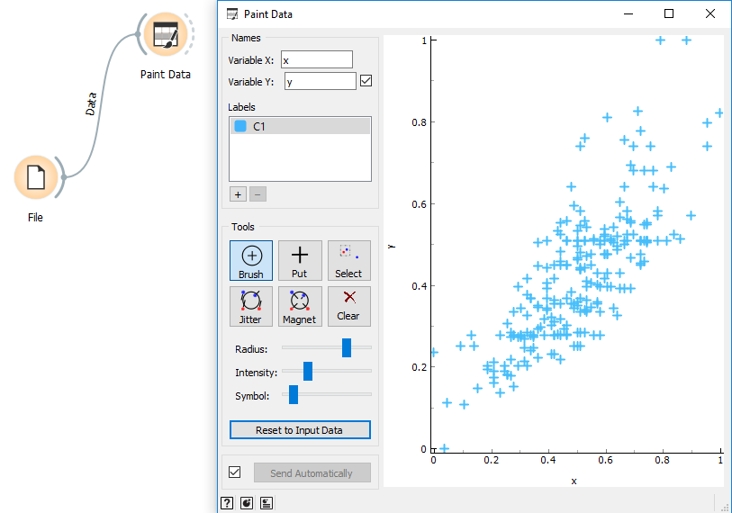
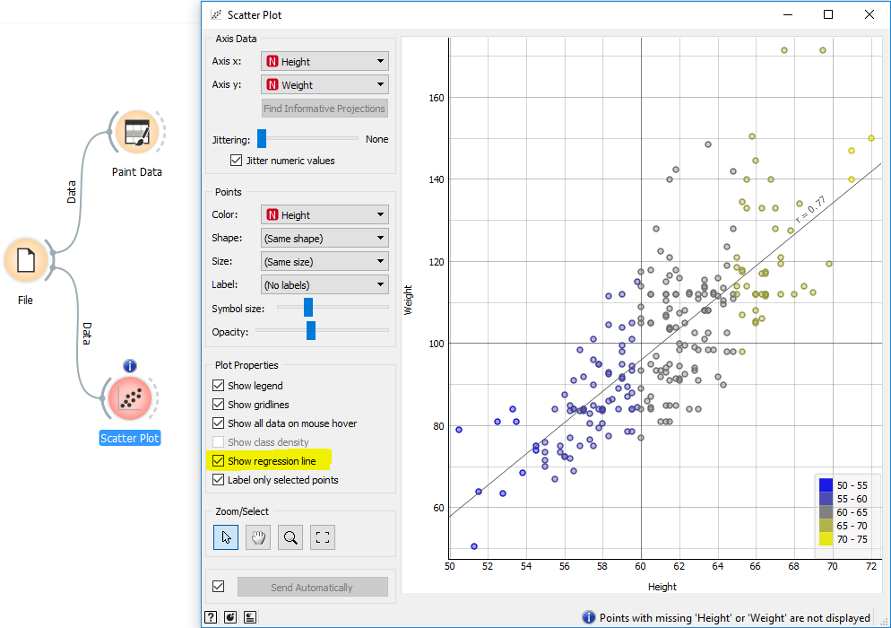

# Creando una regresion lineal

##	Crear un nuevo workflow

### Abrir la herramienta 

- Al momento de abrir la herramienta, nos encontramos con la siguiente pantalla.
#

#
- De las opciones disponibles seleccionaremos, *“New”* para crear un nuevo proyecto.
#

#
- Asignamos un nombre a nuestro trabajo.
#

## Opciones disponibles

- Dentro de la paleta ubicada en la parte derecha, encontraremos una serie de opciones.

## Ingresar datos por archivo

- Para nuestro caso vamos a trabajar con datos q se encuentran dentro de una planilla excel, por lo tanto,
necesitaremos descargar los datos desde el siguiente [link](https://help.xlstat.com/customer/es/portal/articles/2062231-como-realizar-una-regresion-lineal-multiple?b_id=9283).

#
- Para cargar el archivo utilizaremos la opcion *"File"* que se encuetra dentro de la categoría Data de Orange
#

#
- Dentro del elemento *"File"* seleccionaremos nuestro archivo excel con los datos. En este caso se llama
*demo01MultiReg.xls*.
#

#
- **Importante**: en la tabla que aparece debemos cambiar la opcion que aparece a *skip* en caso de que el dato de 
esa columna no nos interese. De lo contrario, debemos cambiar la opción a *feature*. Para nuestro ejemplo solo seleccionamos
los datos **Height** y **Weight**, y el resto de las columnas del archivo las ignoramos.
#

## Dibujar los datos

- Al momento de cargar los datos, los podemos graficar con la herramienta *Paint Data* que se encuentra en la categoría *Data*.
- Hasta el momento tendremos algo como esto:

## Dibujar la regresión lineal con los datos
- Otra forma de graficar es con la herramienta *Scatter Plot* que se encuentra en la categoría *Visualize*. Esta herramienta, aparte de dibujar los datos, nos permite dibujar una función lineal en la grafica de puntos dispersos, esta función representa la regresión lineal. **Importante tener seleccionada la opción *Show regression line* para que efectivamente se muestre la regresión lineal**

## Crear la función de regresión lineal

- Para crear la función de regresión lineal primero tenemos que definir un *target* dentro de las columnas de datos seleccionados, este *target* es la variable dependiente la cual nos interesa predecir.
- Selccionar el target se puede hacer en el momento que se crea el archivo, o con la herramienta *Select Columns*. En este caso utilizaremos la segunda opción y marcaremos el campo **Weight** como *target* y **Height** com *feature*.

#
- Lo siguiente es utilizar la herramienta *Linear Regression* que se encuentra en la categoría *Model*. Esto nos creará un modelo de predicción lineal.
- Para conocer los coeficientes de la función lineal, utilizamos la herramienta *Data Table* de la categoría *Data*.
- La función quedaría de la siguiente forma: **Weight = 3.8181490*Height - 132.9910068**.

## Testear el modelo de regresión lineal
- Para testear el la función utilizaremos la herramienta *Predictions* de la categoría *Evaluate*. Esta herramienta necesita del modelo que se obtuvo de la creación de la regresión lineal, y un set de datos para probar.
- En la columna *Linear Regression* se encuentra el valor que nos entrega la función que creamos a partir de los datos y corresponde al **Weight**. En las otras 2 columnas se encuentran los datos reales de nuestro archivo.

